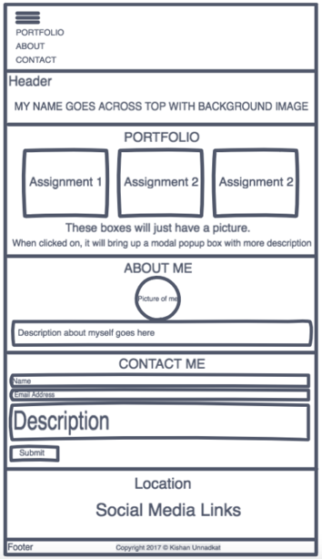
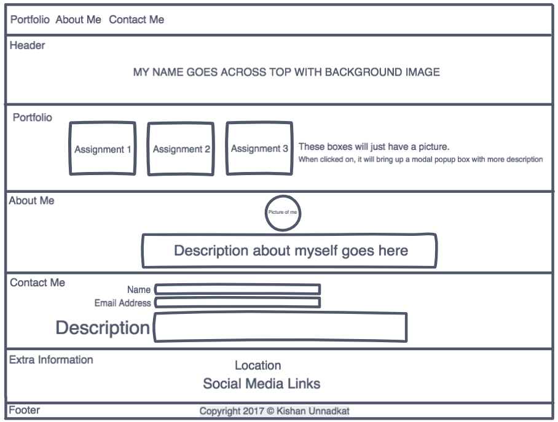

# CTEC3905---Assignment Portfolio Website
Welcome to my Github repository for my CTEC3905 Assignment where I chose to create a single page web application portfolio site for myself consisting of a few of my development projects that I have undertaken throughout my time at university.
<br/>
[Github repository](https://github.com/KishUnnadkat/CTEC3905---Assignment)
<br/>
[Github pages link](https://kishunnadkat.github.io/CTEC3905---Assignment/)


## Designs/Prototypes created on Invisionapp
These are the initial designs created on invisionapp before starting development of the portfolio website.


Designs were not done for tablet styles as I wanted the tablet styles to be similar to the desktop styles and therefore simply resized everything to look proportional on a tablet.


## Development Process
This section of the readme talks about the development process and the some features that were implemented as part of this assignment
* The responsive navigation menu Javascript code was based on the W3Schools example and was adapted to suit my portfolio website
* This website was designed mobile first as demonstrated by the 'min-width' in the css and the site has the following breakpoints - 768px for tablets and 1250px for desktops
* The Google Maps API was used as an external API to display a map of my home location and the provided combined google maps example code was adapted and abstracted out into the relevant css and javascript files
* An external json file called facts.js containing a json array was used to populate the paragraph text in the 'About Me' section.
* On this site, my CV can be viewed/downloaded and my assignments can be downloaded. All these files are linked to the files in the `misc` folder. My assignments are .rar files, which have been password protected.

NOTE: When committing and doing branching process for tablet styles, it didn't work properly and got slightly confused so may not show up on github properly. I then downloaded a GUI called 'sourcetree' to commit my desktop styles branch that I created and didn't show how the branch merged into master visually. Master contains all merged branches but not sure if displayed visually properly.
#### This website has no console errors and has been run through the HTML validator to make sure it is valid HTML5


## Testing
Talk about testing and what was done as part of testing the website
```
Give an example
```


## References
* W3schools.com. (2017). How To Create a Responsive Top Navigation Menu. [online] Available at: https://www.w3schools.com/howto/howto_js_topnav_responsive.asp [Accessed 6 Dec. 2017].
* Validator.w3.org. (2017). The W3C Markup Validation Service. [online] Available at: https://validator.w3.org/ [Accessed 6 Dec. 2017].